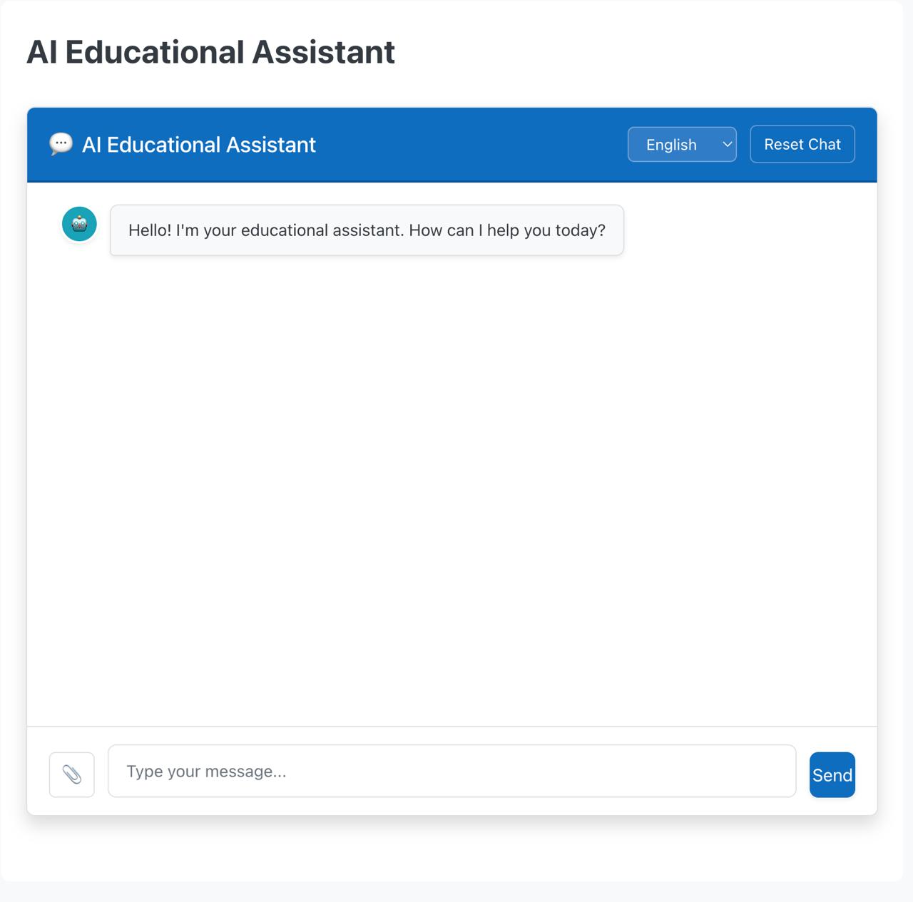

 
# 📘 EduMate – AI-Powered Paper2Digital Plugin  
*NatWest Hack4aCause 2025 – *  

---

## 🎯 Problem Statement
The modern educational system is heavily burdened by inefficiencies in **paper-based learning and assessment**.  

### 1. Traditional Assessment Limitations  
- ⏳ **Time-Intensive Grading**: Educators spend hours marking assignments, reducing time for teaching.  
- ⚖️ **Scalability Issues**: Manual systems cannot handle large student populations.  
- ⌛ **Delayed Feedback**: Students receive generic responses instead of tailored guidance.  

### 2. Digital-Physical Divide  
- 📖 **Fragmented Learning Resources**: Handwritten notes, textbooks, and digital materials remain disconnected.  
- 🚪 **Accessibility Barriers**: Students with disabilities and remote learners struggle with paper-only methods.  
- 🔍 **No Searchability**: Physical documents lack search and indexing capabilities.  

### 3. Complex Assessment Challenges  
- 🎨 **Visual Content**: Flowcharts, equations, and technical diagrams are hard to grade manually.  
- ⚠️ **Consistency Issues**: Human graders differ in evaluation standards.  
- 🌍 **Language Barriers**: Multilingual classrooms add complexity to both teaching and grading.  

---

## 💡 Our Solution – EduMate (Paper2Digital)
EduMate is an **AI-powered Moodle plugin** with a Flask backend that bridges the **paper-to-digital gap**.  
It transforms handwritten, printed, and diagrammatic inputs into **interactive, accessible, and instantly gradable digital content**.  

### 🔑 How EduMate Solves the Problem
- 📝 **Intelligent Document Conversion**  
  - Uses **DocTR OCR + Computer Vision** to digitize handwritten notes, printed materials, and diagrams.  

- 🤖 **Automated Assessment Engine**  
  - Provides **instant grading** of essays, equations, and technical drawings with **AI consistency**.  

- 📝 **Dynamic Question Generation**  
  - Generates quizzes and practice questions automatically from uploaded content.  

- 🌍 **Multilingual AI Tutor**  
  - Supports multiple languages, ensuring inclusivity for diverse student populations.  

- 💬 **Interactive Chatbot**  
  - Built-in learning assistant that explains concepts and provides feedback inside Moodle.  

---

## 🚀 Benefits

### 🎓 For Educators  
- ⏱️ Reduce grading time by up to **80%**  
- 📊 Eliminate bias and human error  
- 🧑‍🏫 Focus on personalized instruction  

### 👩‍🎓 For Students  
- ⚡ **Instant feedback** on submissions  
- 📚 Access to **searchable, digital study resources**  
- 🌍 Learn in **multiple languages**  
- 🤖 Get 24/7 **AI tutoring**  

### 🏫 For Institutions  
- 💰 Cut down operational costs from manual grading  
- 📈 Scale assessments without extra staff  
- 🏫 Stay ahead with modern **AI-driven learning systems**  

---

## 🛠️ Tech Stack
- **AI & Processing:** DocTR, Google Gemini 2 Flash, HuggingFace Transformers, OpenCV  
- **Backend:** Python, Flask  
- **Plugin:** PHP (Moodle API), JavaScript  
- **Hosting:** Snowflake (LearnAIx Platform)  

---
## 📷 Demo Video– Chatbot in Action

## 📷 Demo – Chatbot in Action
  

## License

&copy; Copyright 2025 FINOS

Distributed under the [Apache License, Version 2.0](http://www.apache.org/licenses/LICENSE-2.0).

SPDX-License-Identifier: [Apache-2.0](https://spdx.org/licenses/Apache-2.0)
